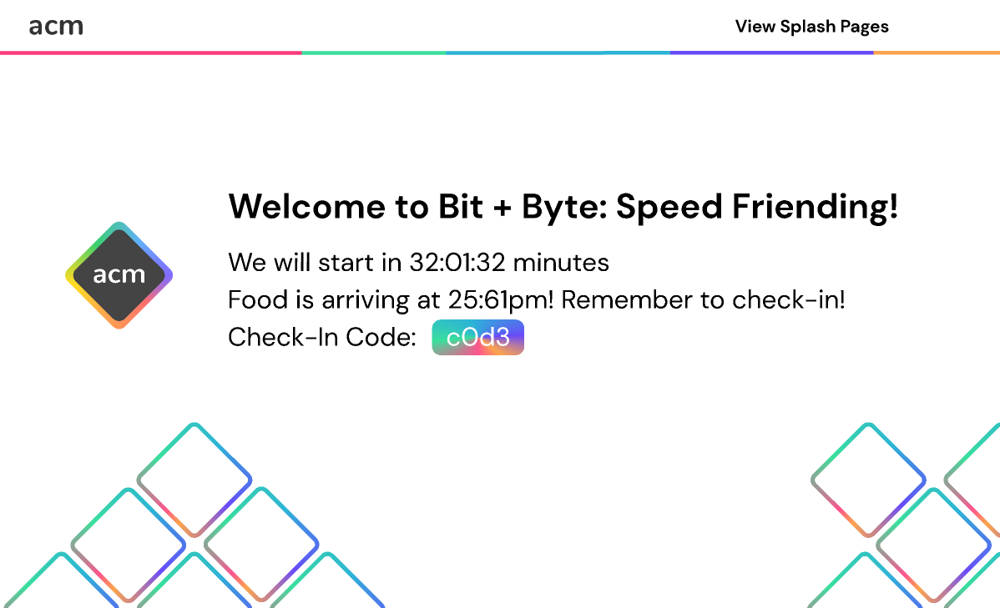

# Welcome to ACM Splash Pages - Backend!
ACM Splash Pages was a project started in Spring 2020 by Purple Team as a part of ACM Side Projects, which I was a part of. The backend team was composed of 3 developers and we collaborated with 1 designer, two frontend developers, and a product manager. We settled on using **React.js** on the front-end, **Express and MongoDB** on the back-end, as well as **Jest** to unit test our back-end routes.

I boilerplated the back-end, built routes, connected the backend to a MongoDB database, documented the entire API, wrote all of the unit tests using Jest, and also wrote the README for getting, running, testing, and deploying the web application.

You can find the README for this project at our [Github repository](https://github.com/brilam8/purple-team-backend).
If you are looking for the documentation, you can find it at our [Github wiki page](https://github.com/brilam8/purple-team-backend/wiki)

## Function 
The Purple Team at ACM Side Projects developed ACM Side Projects as a hassle-free web application that would allow ACM to generate splash pages that displayed the date, location, check-in code, countdown, along with a special background for an event hosted by ACM @ UCSD. To generate a splash page, one first needed to fill out a form:

    

This would then generate a splash page for that event and redirect you to that specific splash page, which would look like this design mock-up:

    

One could then use this splash page as a link to the event, so that all of the most important information of the event was conveyed to the public through a single, aesthetic splash page.

Every event that would be generated through the form was stored in a MongoDB database that we connected the back-end to. This was paramount because we wanted a single page where we can see every recent and future event that we had generated splash pages for. Clicking on the "View Splash Pages" button leads to a page that looks like this: 

    

Administrators to the page would have the extra dropdown menu to edit or delete and event. Everything was set up in the back-end, in which you can find the documentation for at the [wiki](https://github.com/brilam8/purple-team-backend/wiki). There is also a search bar in which you can search for specific events in terms of their tags, time, location, or name - this was made possible through querying MongoDB for specific events that had matching elements.

## Development
ACM Side Projects was a program that mimicked how software development companies work in real life, with AGILE practices and team stand-ups. Our team met every two weeks, in which we discussed features that we completed or want to complete for the next two weeks, as well as updates from the rest of the team. 

We constantly collaborated with each other on Discord to ensure that our newer features matched up with how the design/front-end team was envisioning the final product.

I found development to be different, yet more productive than the way I normally worked on my projects in the past. Focusing on a specific feature/goal for 2 weeks at a time, then moving on to polishing or building more features for the next 2 weeks ensures that features are completed and not half-built then abandoned for another developer to find in the future.

## What did I take away?
By working solely on the back-end for this project, I was meticulous about building a structure that would be expandable and clean to work on from the very start. The folder structure was extremely defined and it was clear what portions of the back-end one was working on based solely on the folder they were in. The first boilerplate that I put out for the back-end took me almost 2 hours because I wanted to get a clean codebase from the start, and I wanted to get it right this time.

In addition, I placed a strong emphasis on maintaining the project by writing the entire README, documenting the entire API along with the models that we used for the database, along with building unit tests utilizing Jest to test the web application before deploying it to Heroku. All of the documentation on this project makes it much easier to look back on and work on in the future. All of the information is centralized in a few locations. Getting, running, testing, and deploying can all be found on the [README](https://github.com/brilam8/purple-team-backend), while all API routes and methods can be found on the [Wiki](https://github.com/brilam8/purple-team-backend/wiki)